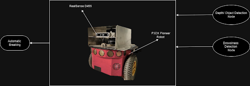

# Elevating-Safety-Through-the-Synergy-of-Interior-Monitoring-and-External-Protection
The Driver Safety Enhancement System is a revolutionary concept that aims to provide enhanced protection for both the driver of a vehicle and pedestrians. This system incorporates advanced technologies to reduce the risk of accidents by ensuring driver attentiveness and taking preventive actions in critical situations.

## Key Features

### Driver Alertness Enhancement
To guarantee optimal driver attentiveness, our system incorporates a state-of-the-art Drowsiness Detection Module. This module continuously monitors the driver's condition and takes immediate action based on the object's depth in front of the robot or car in case of drowsiness.

#### Drowsiness Detection
The Drowsiness Detection Module is designed to:

- Continuously monitor the driver's condition.
- Detect signs of drowsiness, fatigue, or inattentiveness.
- Promptly alert the driver when drowsiness is detected.
- Provide visual and auditory warnings to awaken the driver.

#### Obstacle Detection
In addition to monitoring driver attentiveness, the system acts as an additional layer of safety by detecting obstacles in the vehicle's path.

- Automatically halt the vehicle if an obstacle appears in its path.
- Engage when predefined safety thresholds are breached.
- Prevent potential collisions with pedestrians and other objects.

## How It Works
Our Driver Safety Enhancement System utilizes a combination of cameras and advanced algorithms to ensure driver safety. Here's how it works:

1. Continuous Monitoring:
   - The Drowsiness Detection Module continuously monitors the driver's condition, including factors like eye movement and head position.

2. Drowsiness Alert:
   - When signs of drowsiness are detected, the system promptly alerts the driver using visual and auditory cues.

3. Obstacle Detection:
   - The system constantly scans the vehicle's surroundings using advanced cameras.

4. Automatic Halt:
   - when Person's drowsiness is detected, and if an obstacle appears in the vehicle's path and the predefined safety threshold is breached, the system takes control and automatically halts the vehicle.
     


## Requirements

To use this project, you need the following dependencies:

1. Python 3.8.10
2. TensorFlow 2 (Version 2.13.1)
3. Ubuntu (Version 20.04)
4. pyrealsense2 (Intel RealSense D455)
5. ROS Noetic

Make sure to install and configure these dependencies before running the project.
## Getting Started
### Step 1: Clone this repository
```
git clone https://github.com/your-username/Elevating-Safety-Through-the-Synergy-of-Interior-Monitoring-and-External-Protection.git
```

### Step 2: Change directory to the project folder
```
cd Elevating-Safety-Through-the-Synergy-of-Interior-Monitoring-and-External-Protection/
```
### Step 3: To run the depth module, navigate to the depth module directory
```
cd depth_module/measure_object_distance/
```
### Step 4: Run the depth module
```
python3 measure_object_distance.py
```
### Step 5: In a new terminal, change directory to the ROS workspace and build the project
```
cd Elevating-Safety-Through-the-Synergy-of-Interior-Monitoring-and-External-Protection/integration_ws/
catkin_make
source devel/setup.bash
```
### Step 6: Run the Drowsiness Detection ROS node
```
rosrun integration_p3dx detect_drowsiness_ros.py
```

### Step 7: In a new terminal, run the Robot Prototype
```
rosrun integration_p3dx integrate_p3dx.py
```
### For running the Car Prototype, use the following command
```
rosrun integration_p3dx integrate_Car.py
```

## Benefits
The Driver Safety Enhancement System offers the following benefits:

- Enhanced driver safety and attentiveness.
- Prevention of potential accidents and collisions.
- Improved protection for both the driver and pedestrians.
## Results

## References
1.
## Future Development
We envision continuous improvement and refinement of this system by integrating more advanced technologies, such as machine learning and artificial intelligence, to enhance its performance and safety features further.

## Disclaimer
Please note that this README file is a conceptual description of an idea and does not represent a fully functional product. Implementing such a system would require extensive research, development, and testing to ensure its effectiveness and reliability.

